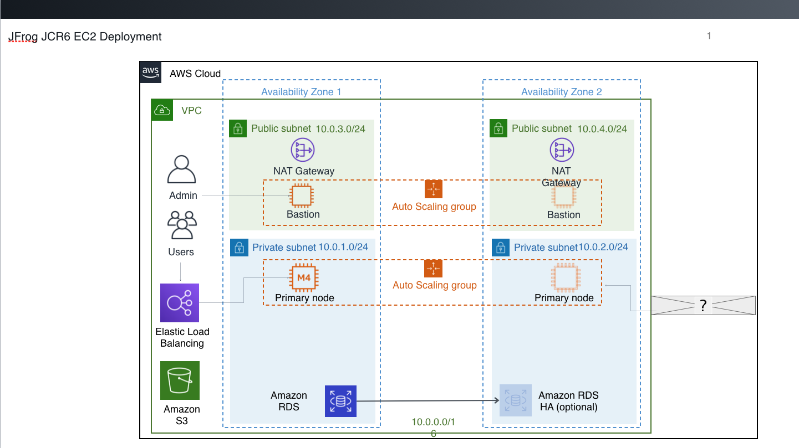
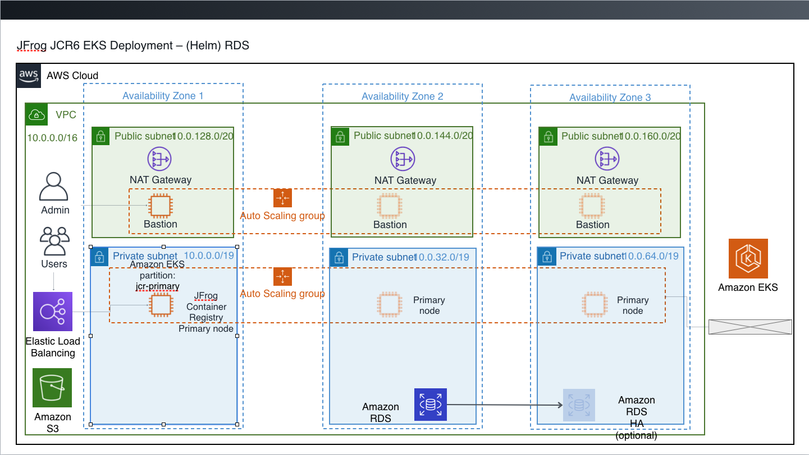

# quickstart-jfrog-artifactory
## JFrog Container Registry on AWS Cloud

Two new Quick Starts deploy JFrog Container Registry on the Amazon Web Services (AWS) Cloud in 60-90 minutes. The available options for deployment use your choice of Amazon Elastic Compute Cloud (Amazon EC2) or Amazon Elastic Kubernetes Service (Amazon EKS).

This Quick Start is for administrators who want to use JFrog Container Registry with the flexibility, scale, and availability of AWS.

Note that if you are using the Amazon EKS option, Amazon EKS is not available in all AWS Regions. For a current list of supported Regions, see the [AWS Regions and Endpoints webpage](https://docs.aws.amazon.com/general/latest/gr/rande.html#eks_region).

You can use the AWS CloudFormation templates included with the Quick Start to deploy JFrog Container Registry into a new or existing virtual private cloud (VPC) in your AWS account. The Quick Starts automates the following:

- Deploying JFrog Container Registry with Amazon EC2
- Deploying JFrog Container Registry with Amazon EKS

For architectural details, best practices, and step-by-step instructions, see the deployment guide for JFrog Container Registry with [Amazon EC2]( documentation/jfrog-conatiner-registry-with-amazon-ec2-on-the-aws-cloud ) or [Amazon EKS]( documentation/jfrog-conatiner-registry-with-amazon-eks-on-the-aws-cloud ).

To post feedback, submit feature ideas, or report bugs, use the **Issues** section of this GitHub repo.
If you'd like to submit code for this Quick Start, please review the [AWS Quick Start Contributor's Kit](https://aws-quickstart.github.io/).
